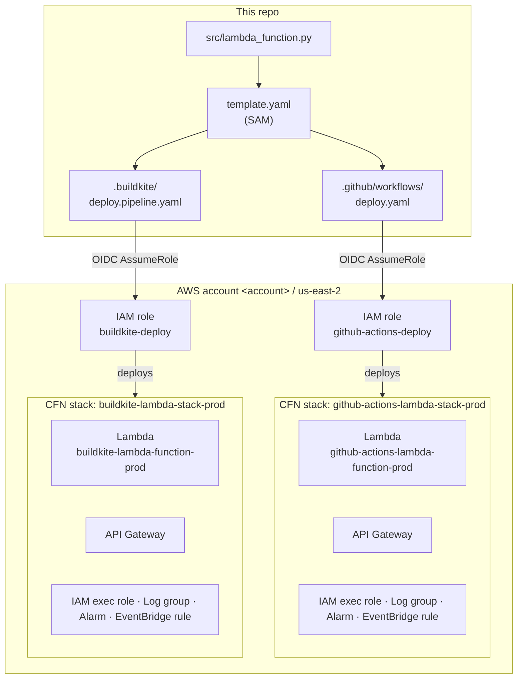

# aws-lambda-deploy

A single Python AWS Lambda function deployed by **two parallel CI/CD pipelines**. Both pipelines build from the same `template.yaml` and `src/`, but they target separate CloudFormation stacks so they don't collide — you end up with two independent Lambda functions in the account.

| Pipeline | Stack | Function | Triggered by |
|---|---|---|---|
| **GitHub Actions** | `github-actions-lambda-stack-<env>` | `github-actions-lambda-function-<env>` | Push to `main` / `staging`, PRs validate only |
| **Buildkite** | `buildkite-lambda-stack-<env>` | `buildkite-lambda-function-<env>` | Push to `main` (staging auto, prod gated), `staging` (staging only) |

Both pipelines authenticate to AWS via OIDC (no long-lived access keys). Each has its own deploy role and permission policy.

---

## Read more

- **[GitHub Actions guide](docs/ci/github-actions.md)** — pipeline flow, AWS one-time setup (OIDC provider, role, policy), triggers, deploying a change
- **[Buildkite guide](docs/ci/buildkite.md)** — pipeline flow with manual prod gate, AWS one-time setup, deploying a change

---

## Architecture



---

## Repository layout

```
.
├── src/
│   └── lambda_function.py               # handler: lambda_function.handler
├── template.yaml                        # SAM template — all AWS resources
├── .github/workflows/deploy.yaml        # GitHub Actions pipeline
├── .buildkite/deploy.pipeline.yaml      # Buildkite pipeline
├── docs/
│   ├── ci/
│   │   ├── github-actions.md            # GH Actions guide
│   │   └── buildkite.md                 # Buildkite guide
│   └── aws/
│       ├── policies/                    # IAM permission policies
│       │   ├── sam-deploy-lambda-stack .json
│       │   └── buildkite-deploy-policy.json
│       └── roles/                       # IAM trust policies
│           ├── github-actions-deploy.json
│           └── buildkite-deploy.json
└── README.md
```

---

## Local development

```bash
# Validate the template
sam validate --template template.yaml --region us-east-2

# Build (needs Docker)
sam build --template template.yaml --use-container

# Invoke locally
sam local invoke MyLambdaFunction --event events/test-event.json

# Or run the local API
sam local start-api
curl -X POST http://127.0.0.1:3000/invoke
```

---

## Why two pipelines?

Keeping them side-by-side is intentional — it lets you compare behavior, lock-in/lock-out, and operational ergonomics between the two CI systems against an identical workload. If you ever consolidate, delete the other pipeline file and its CloudFormation stack (`aws cloudformation delete-stack --stack-name <stack>`) and revoke the unused IAM role.
