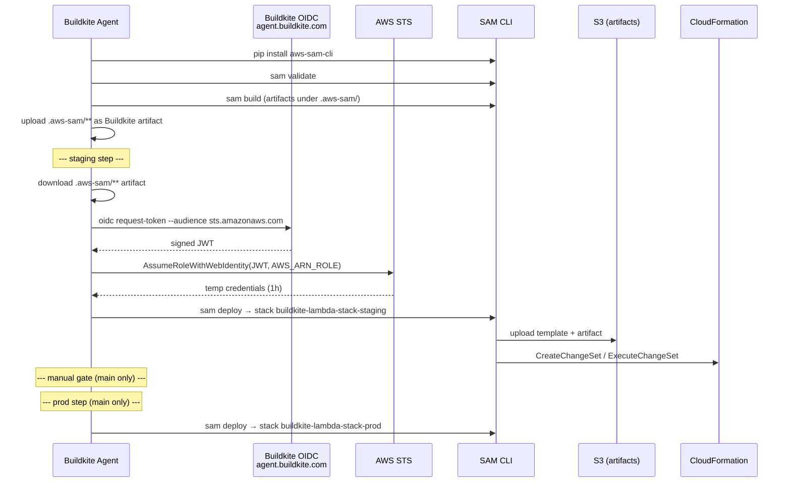
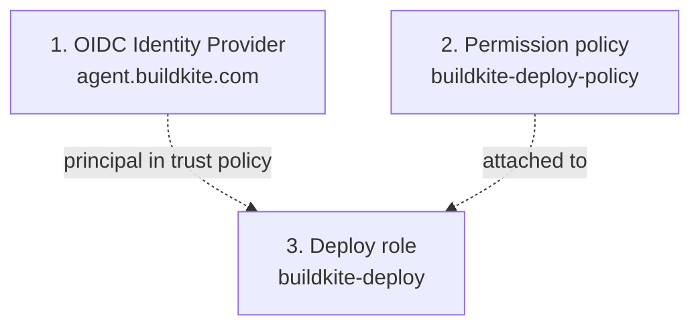
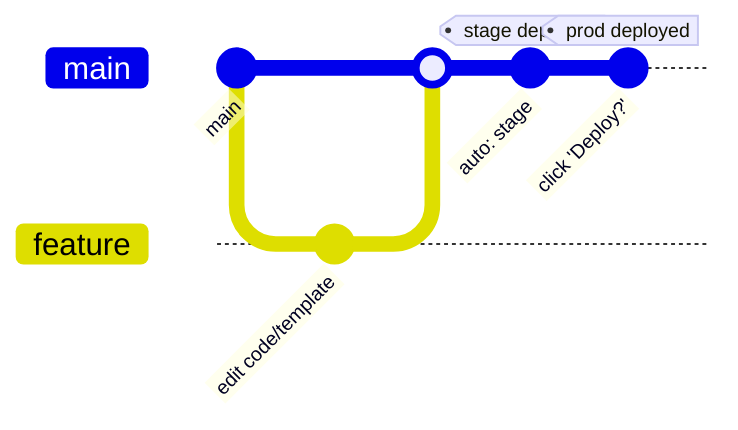

# Buildkite deployment

Deploys the **same** Lambda code as the GitHub Actions pipeline, but to a separate CloudFormation stack and function so the two paths don't collide. Stack ownership: **`buildkite-lambda-stack-<env>`**, function name **`buildkite-lambda-function-<env>`**.

Pipeline file: [`.buildkite/deploy.pipeline.yaml`](../../.buildkite/deploy.pipeline.yaml)

---

## Triggers

| Branch | Behavior |
|---|---|
| `main` | Validate → Build → Deploy to **staging** → **Manual gate** → Deploy to **prod** |
| `staging` | Validate → Build → Deploy to **staging** |
| Any other | Validate → Build only |

The manual gate (`block` step) requires a human to click "Deploy to Production?" in the Buildkite UI before prod runs.

---

## Pipeline flow



Steps in `deploy.pipeline.yaml`:

| # | Step | Purpose |
|---|---|---|
| 1 | ✅ Validate SAM Template | `sam validate` against the template |
| 2 | 🔨 SAM Build | Run `sam build` and upload `.aws-sam/**` as artifacts |
| 3 | 🚀 Deploy to Staging | Assume role via OIDC, then `sam deploy` to `buildkite-lambda-stack-staging` (runs on `main` or `staging`) |
| 4 | ⚠️ Manual gate | Block step (`main` only) requiring human approval |
| 5 | 🚀 Deploy to Production | Same as step 3, but stack `buildkite-lambda-stack-prod` (`main` only) |

---

## One-time AWS setup

Same shape as the GitHub Actions setup, but uses Buildkite's OIDC issuer instead of GitHub's:



### Step 1 — Create the OIDC Identity Provider

Tells AWS to trust JWTs signed by Buildkite. **Do this once per AWS account** — all Buildkite pipelines in your org can share it.

**Console:**
1. IAM → **Identity providers** → **Add provider**
2. Provider type: **OpenID Connect**
3. Provider URL: `https://agent.buildkite.com`
4. Audience: `sts.amazonaws.com`
5. **Get thumbprint** — AWS will fetch and verify it
6. **Add provider**

**CLI equivalent:**
```bash
aws iam create-open-id-connect-provider \
  --url https://agent.buildkite.com \
  --client-id-list sts.amazonaws.com
```

The resulting ARN is `arn:aws:iam::<account>:oidc-provider/agent.buildkite.com` — you'll reference it in the role's trust policy.

> Buildkite documents the OIDC issuer at <https://buildkite.com/docs/agent/v3/cli-oidc>. The `buildkite-agent oidc request-token` CLI in the pipeline file is what mints the JWT at runtime.

### Step 2 — Create the permission policy `buildkite-deploy-policy`

Grants the deploy role permission to manage every resource the SAM template creates. JSON lives at [`docs/aws/policies/buildkite-deploy-policy.json`](../aws/policies/buildkite-deploy-policy.json).

**Console:**
1. IAM → **Policies** → **Create policy** → **JSON** tab
2. Paste the JSON from the file above; replace `[AWS_ACCOUNT_ID]`, `[AWS_REGION]`, `[AWS_BUCKET_NAME]` with real values
3. **Next** → name it `buildkite-deploy-policy` → **Create policy**

**CLI equivalent:**
```bash
aws iam create-policy \
  --policy-name buildkite-deploy-policy \
  --policy-document file://docs/aws/policies/buildkite-deploy-policy.json
```

### Step 3 — Create the deploy role `buildkite-deploy`

The trust policy says *which* Buildkite pipelines can assume the role. Template lives at [`docs/aws/roles/buildkite-deploy.json`](../aws/roles/buildkite-deploy.json).

The `sub` condition in Buildkite OIDC tokens looks like:

```
organization:<org-slug>:pipeline:<pipeline-slug>:ref:refs/heads/<branch>:commit:<sha>:step:<step-key>
```

Common scoping patterns:

| Pattern | Trusts |
|---|---|
| `organization:<org>:*` | Any pipeline in the org |
| `organization:<org>:pipeline:<pipeline>:*` | One specific pipeline, any branch |
| `organization:<org>:pipeline:<pipeline>:ref:refs/heads/main:*` | Only `main` branch runs of that pipeline |

**Console:**
1. IAM → **Roles** → **Create role** → **Web identity**
2. Identity provider: `agent.buildkite.com`
3. Audience: `sts.amazonaws.com`
4. **Next** → attach `buildkite-deploy-policy`
5. **Next** → name it `buildkite-deploy` → **Create role**
6. Open the role → **Trust relationships** → **Edit trust policy** → paste the JSON from the file above with `[AWS_ACCOUNT_ID]` and `[ORGANIZATION_NAME]` substituted

**CLI equivalent:**
```bash
aws iam create-role \
  --role-name buildkite-deploy \
  --assume-role-policy-document file://docs/aws/roles/buildkite-deploy.json
aws iam attach-role-policy \
  --role-name buildkite-deploy \
  --policy-arn arn:aws:iam::<account>:policy/buildkite-deploy-policy
```

Copy the role ARN — you'll add it to Buildkite next.

---

## One-time Buildkite setup

Buildkite UI → your pipeline → **Settings** → **Secrets** (or organization-level secrets if you want to share across pipelines):

| Name | Value |
|---|---|
| `AWS_ARN_ROLE` | `arn:aws:iam::<account>:role/buildkite-deploy` |

The pipeline references it as `$$AWS_ARN_ROLE` (double `$` so Buildkite doesn't interpolate at upload time — the value is resolved inside the running step instead).

---

## Deploying a change



1. Push to `main` (or merge a PR into `main`). The pipeline auto-deploys to `buildkite-lambda-stack-staging`.
2. The pipeline blocks at the manual gate. Open the build in Buildkite and click **Deploy to Production?** to unblock.
3. Production deploy runs to `buildkite-lambda-stack-prod` and prints stack outputs.

For a staging-only rehearsal, push to `staging` instead — the manual gate is skipped because the prod step is gated on `branches: "main"`.

---

## Deployed outputs

The prod step calls `describe-stacks` at the end and prints the outputs table. To fetch them manually:

```bash
aws cloudformation describe-stacks \
  --stack-name buildkite-lambda-stack-prod \
  --region us-east-2 \
  --query "Stacks[0].Outputs" \
  --output table
```

- `LambdaFunctionArn` — function ARN
- `ApiGatewayUrl` — public POST endpoint at `/<env>/invoke`
- `LambdaExecutionRoleArn` — execution role ARN

---

## Configuration reference

| Setting | Where | Current value |
|---|---|---|
| AWS region | pipeline env `AWS_DEFAULT_REGION` | `us-east-2` |
| AWS account | n/a | `<account>` |
| SAM artifacts bucket | pipeline env `SAM_BUCKET` | `deployment-artifacts-<account>-us-east-2-an` |
| Stack name pattern | inline in pipeline | `buildkite-lambda-stack-<env>` |
| Function name pattern | parameter `FunctionName` | `buildkite-lambda-function-<env>` |
| Lambda runtime | `template.yaml` Globals | `python3.12` |
| Handler | `template.yaml` | `lambda_function.handler` |
| Agent queue | `agents.queue` | `linux-small` |
| Deploy role | Buildkite secret `AWS_ARN_ROLE` | `arn:aws:iam::<account>:role/buildkite-deploy` |
