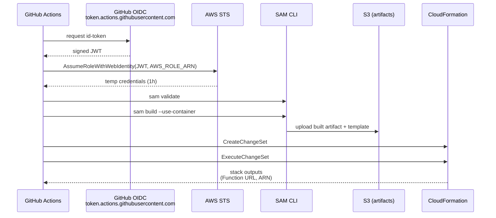
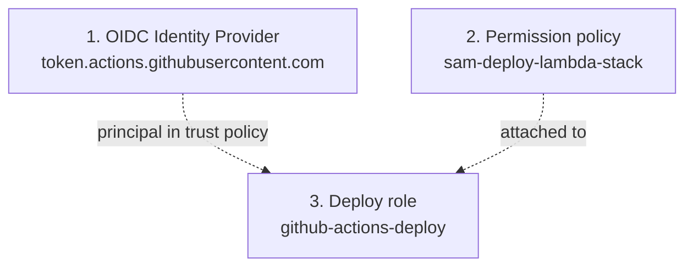
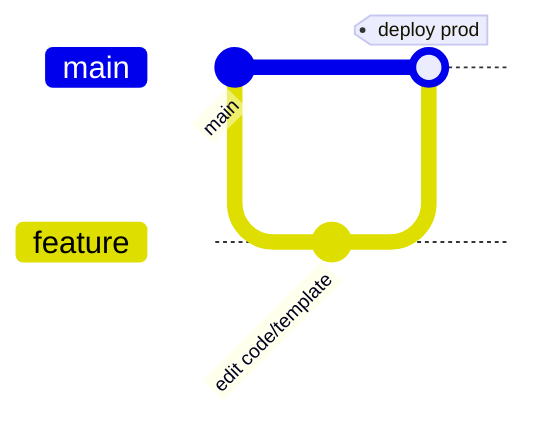

# GitHub Actions deployment

Deploys the Lambda function and its supporting AWS resources via AWS SAM + CloudFormation. Stack ownership: **`github-actions-lambda-stack-<env>`**, function name **`github-actions-lambda-function-<env>`**.

Pipeline file: [`.github/workflows/deploy.yaml`](../../.github/workflows/deploy.yaml)

---

## Triggers

| Event | Branch | Action |
|---|---|---|
| `push` | `main` | Deploy to **prod** (stack `github-actions-lambda-stack-prod`) |
| `push` | `staging` | Deploy to **staging** (stack `github-actions-lambda-stack-staging`) |
| `pull_request` | targeting `main` | Validate + build only (no deploy) |

---

## Pipeline flow



Steps in `deploy.yaml`:

| # | Step | Purpose |
|---|---|---|
| 1 | Checkout | Pull repo into the runner |
| 2 | Set up Python 3.12 | Match the Lambda runtime |
| 3 | Set up SAM CLI | `aws-actions/setup-sam@v2` |
| 4 | Configure AWS credentials (OIDC) | Exchange GitHub JWT for AWS temp creds |
| 5 | Set environment name | `prod` for `main`, `staging` otherwise |
| 6 | `sam validate` | Lint the template before doing anything |
| 7 | `sam build --use-container` | Package code in a Lambda-compatible Docker image |
| 8 | `sam deploy` | Upload to S3, create/execute CFN changeset (skipped on PRs) |
| 9 | Print stack outputs | Show API URL / ARNs after deploy |

---

## One-time AWS setup

You need three things in AWS, once per account:



### Step 1 — Create the OIDC Identity Provider

This tells AWS to trust JWTs signed by GitHub's OIDC issuer. **Do this once per AWS account** — all repos can share the same provider.

**Console:**
1. IAM → **Identity providers** → **Add provider**
2. Provider type: **OpenID Connect**
3. Provider URL: `https://token.actions.githubusercontent.com`
4. Audience: `sts.amazonaws.com`
5. **Add provider**

**CLI equivalent:**
```bash
aws iam create-open-id-connect-provider \
  --url https://token.actions.githubusercontent.com \
  --client-id-list sts.amazonaws.com
```

> AWS no longer requires the thumbprint — it's auto-managed since 2023.

The resulting ARN is `arn:aws:iam::<account>:oidc-provider/token.actions.githubusercontent.com` — you'll reference it in the role's trust policy.

### Step 2 — Create the permission policy `sam-deploy-lambda-stack`

This grants the deploy role permission to manage every resource the SAM template creates. JSON lives at [`docs/aws/policies/sam-deploy-lambda-stack .json`](../aws/policies/sam-deploy-lambda-stack%20.json).

**Console:**
1. IAM → **Policies** → **Create policy** → **JSON** tab
2. Paste the JSON from the file above; replace `[AWS_ACCOUNT_ID]`, `[AWS_REGION]`, `[AWS_BUCKET_NAME]` with real values
3. **Next** → name it `sam-deploy-lambda-stack` → **Create policy**

**CLI equivalent:**
```bash
aws iam create-policy \
  --policy-name sam-deploy-lambda-stack \
  --policy-document file://docs/aws/policies/sam-deploy-lambda-stack\ .json
```

### Step 3 — Create the deploy role `github-actions-deploy`

The role's **trust policy** says *which* GitHub workflows can assume it. Template lives at [`docs/aws/roles/github-actions-deploy.json`](../aws/roles/github-actions-deploy.json).

The `sub` condition controls the scope:

| Pattern | Trusts |
|---|---|
| `repo:OWNER/REPO:*` | Any branch or PR in the repo |
| `repo:OWNER/REPO:ref:refs/heads/main` | Only `main` branch pushes |
| `repo:OWNER/REPO:environment:prod` | Only workflows that target the `prod` environment (recommended for prod) |

**Console:**
1. IAM → **Roles** → **Create role** → **Web identity**
2. Identity provider: `token.actions.githubusercontent.com`
3. Audience: `sts.amazonaws.com`
4. GitHub organization: your org, Repository: your repo
5. **Next** → attach `sam-deploy-lambda-stack`
6. **Next** → name it `github-actions-deploy` → **Create role**
7. Open the role → **Trust relationships** → **Edit trust policy** → paste the JSON from the file above with `[AWS_ACCOUNT_ID]` and `[REPO_ORG]` substituted

**CLI equivalent:**
```bash
aws iam create-role \
  --role-name github-actions-deploy \
  --assume-role-policy-document file://docs/aws/roles/github-actions-deploy.json
aws iam attach-role-policy \
  --role-name github-actions-deploy \
  --policy-arn arn:aws:iam::<account>:policy/sam-deploy-lambda-stack
```

Copy the role ARN — you'll add it to GitHub next.

---

## One-time GitHub setup

GitHub repo → **Settings** → **Secrets and variables** → **Actions** → **New repository secret**:

| Name | Value |
|---|---|
| `AWS_ROLE_ARN` | `arn:aws:iam::<account>:role/github-actions-deploy` |

The workflow's `permissions: id-token: write` block (already present in `deploy.yaml`) is what allows GitHub to issue an OIDC token for the runner.

---

## Deploying a change



1. Open a PR against `main`. The pipeline runs `sam validate` + `sam build` on the PR (no deploy).
2. Merge the PR → pipeline re-runs on `main` and deploys to **prod**.
3. For a staging rehearsal, push to a `staging` branch first.

---

## Deployed outputs

After a successful run, find outputs in the workflow log (step "Get stack outputs") or via:

```bash
aws cloudformation describe-stacks \
  --stack-name github-actions-lambda-stack-prod \
  --region us-east-2 \
  --query "Stacks[0].Outputs" \
  --output table
```

- `LambdaFunctionArn` — function ARN
- `ApiGatewayUrl` — public POST endpoint at `/<env>/invoke`
- `LambdaExecutionRoleArn` — execution role ARN

---

## Configuration reference

| Setting | Where | Current value |
|---|---|---|
| AWS region | workflow env `AWS_REGION` | `us-east-2` |
| AWS account | repo variable `AWS_ACCOUNT_ID` | `<account>` |
| SAM artifacts bucket | repo variable `SAM_BUCKET` | `deployment-artifacts-<account>-us-east-2-an` |
| Stack name pattern | workflow env `STACK_NAME` | `github-actions-lambda-stack-<env>` |
| Function name pattern | parameter `FunctionName` | `github-actions-lambda-function-<env>` |
| Lambda runtime | `template.yaml` Globals | `python3.12` |
| Handler | `template.yaml` | `lambda_function.handler` |
| Deploy role | GitHub secret `AWS_ROLE_ARN` | `arn:aws:iam::<account>:role/github-actions-deploy` |
